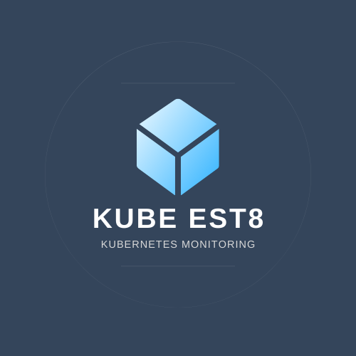

<h1 align="center">
    Kube-Est8
    <br>
    
</h1>

<p align="center">
  <i align="center">Monitor your Kubernetes cluster's resource usage and vulnerabilities across different levels </i>🖥️
</p>

<h4 align="center">
    
</h4>
<h4 align="center">
    
</h4>
<h4 align="center">
    
</h4>


## Introduction

`Kube Est8(beta)` is an open source application being developed to offer developers a Kubernetes monitoring solution that places a focus on bottleneck detection and security vulnerabilities. Core features include metric visualization through Grafana graphs, using time-series data collected by Prometheus from your cluster, node graph flow chart for interactive rendering of the cluster as well as ability to create and delete nodes, health metrics related to each node of the cluster, security vulnerability scan, and bottleneck detection, especially those resulting from AI or ML workloads. 


## Setup

Clone repository, install dependencies, and run:

```
git clone https://github.com/oslabs-beta/kube-est8.git
cd kube-est8
npm i
npm start
```


## Spinning up Kubernetes

The Kubernetes command-line tool, [kubectl](https://kubernetes.io/releases/download/), allows you to run commands against Kubernetes clusters.

Kube-Est8 will connect to the cluster configured in your [`/kubeconfig`](https://kubernetes.io/docs/concepts/configuration/organize-cluster-access-kubeconfig/) file.


## Setting up Kubernetes Metrics Server

[Kubernetes Metrics Server](https://github.com/kubernetes-sigs/metrics-server) collects resource metrics from Kubelets and exposes them in Kubernetes apiserver.


## Setting up Prometheus

### Prometheus
[Prometheus](https://prometheus.io/) is an open-source monitoring tool. It offers built-in monitoring capabilities for Kubernetes clusters, and it excels at collecting and analyzing metrics to trigger alerts.

### Image
The latest Prometheus version can be found on [DockerHub](https://hub.docker.com/r/prom/prometheus/tags).

### Namespace
We can create a new namespace for our Prometheus deployment objects: `kubectl create namespace monitoring`

### RBAC Policy
We need to create an RBAC policy with read access to required API groups and bind the policy to the monitoring namespace because Prometheus uses Kubernetes APIs to read metrics.
Create the role using your configured clusterRole file: `kubectl create -f clusterRole.yaml`

### Config Map
A config map needs to be created to externalize Prometheus configurations so we don't have to rebuild the Prometheus image when adding or removing configurations. Create a `config-map.yaml` file, configure it appropriately, then create the config map using `kubectl create -f config-map.yaml`.

### Prometheus deployment
Next, create and configure your `prometheus-deployment.yaml`. It can be created with `kubectl create -f prometheus-deployment.yaml`. You can check the deployment using `kubectl get deployments --namespace=monitoring`.

### Accessing Prometheus Dashboard
Can be accessed by exposing Prometheus as a service by creating and configuring your `prometheus-service.yaml` file using a nodeport type, then using `kubectl create -f prometheus-service.yaml --namespace=monitoring` to create service.


## Tests
